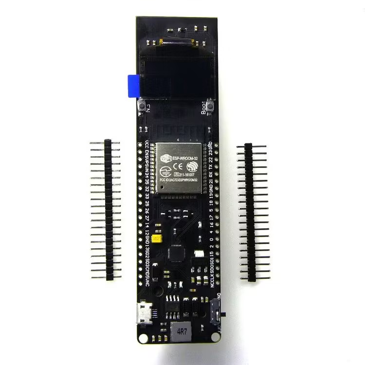
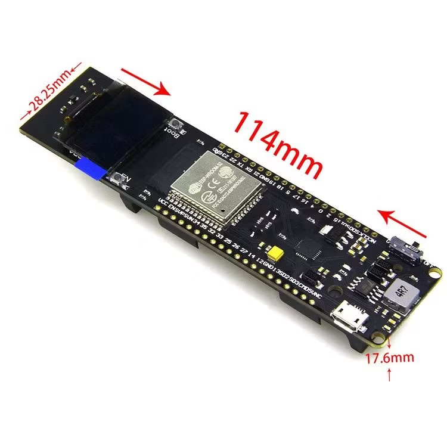
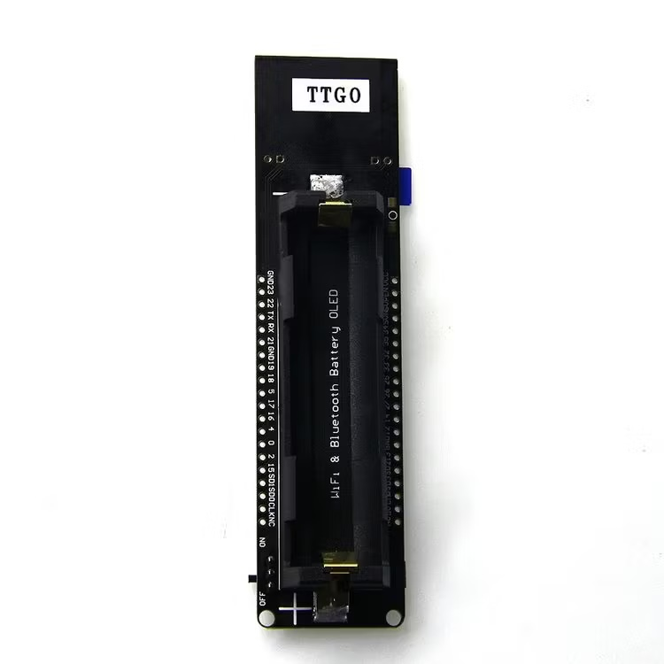
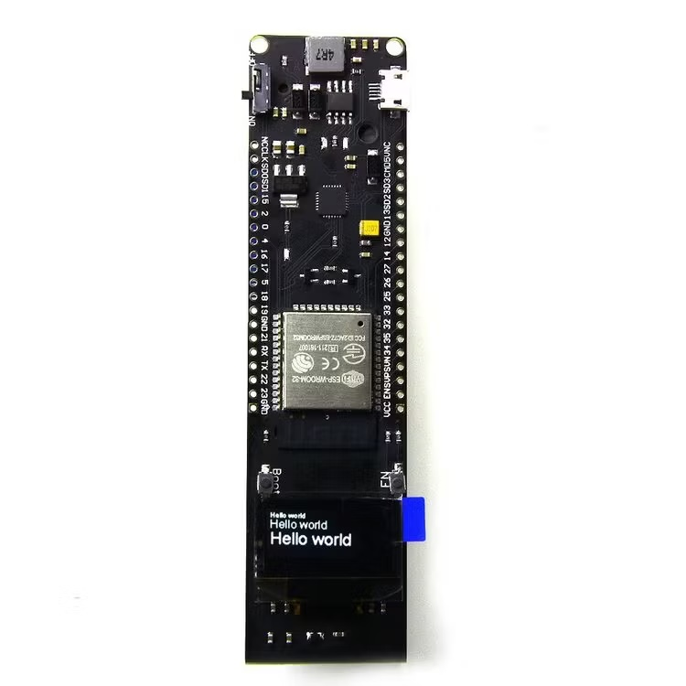
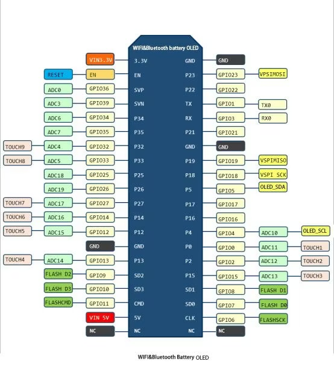

# ESP32 OLED GPS NEO-M8M

PlatformIO/Arduino firmware for an ESP32 OLED 18650 board with an onboard 0.96" 128x64 I2C OLED and a u-blox NEO-M8M GPS module.

The project reads NMEA data from the GPS on ESP32 UART2, keeps the Serial
Monitor readable with compact diagnostics, and renders the current GPS state on
the onboard OLED using only the first five rows because this board's bottom OLED
line is damaged.

## Board Reference

Target board: TTGO WiFi & Bluetooth Battery ESP32 0.96 Inch OLED Development Tool.

Product photos and board details below are from the
[HiTechChain product page](https://hitechchain.se/iot/ttgo/esp32-pico-kit-utvecklingsbord).












Short board specification:

- ESP32 development board with Wi-Fi and Bluetooth.
- ESP32-WROOM-32 module on the board revision shown in the product photos.
- Integrated 0.96" OLED.
- 18650 cell holder and onboard charging system.
- USB, 5 V, or 18650 power input paths.
- Charging and running at the same time are supported by the board.
- Charge indicator LED: red while charging, green when full.
- Power switch on the board.
- Extra programmable LED connected to `GPIO16` / `D0`.
- Listed charging current: 0.5 A.
- Listed output current: 1 A.
- Over-charge and over-discharge protection.
- Full ESP32 pin breakout.
- Product image marks approximate board dimensions as 114 mm x 28.25 mm x 17.6 mm.

## Hardware

Target board:

- ESP32 OLED 18650 development board
- ESP32-WROOM-32
- Onboard OLED 0.96" 128x64 I2C
- USB, 5 V, or 18650 power
- 3.3 V GPIO logic

GPS module:

- GY-GPSV3-NEO / u-blox NEO-M8M
- UART TTL NMEA
- Firmware auto-detects common NMEA UART baud rates: `9600`, `38400`, `4800`, `19200`, `57600`, `115200`

## Pinout

GPS to ESP32:

| GPS module | ESP32 |
| --- | --- |
| VCC | 3V3 |
| GND | GND |
| TX | GPIO26, ESP32 UART2 RX |
| RX | GPIO25, ESP32 UART2 TX |

Onboard OLED:

| OLED | ESP32 |
| --- | --- |
| SDA | GPIO5 |
| SCL | GPIO4 |

Avoid these pins for GPS:

- `GPIO1` / `GPIO3`: USB serial and upload
- `GPIO6` - `GPIO11`: ESP32 flash
- `GPIO16`: onboard programmable LED on this board
- `GPIO0`, `GPIO2`, `GPIO12`, `GPIO15`: bootstrapping pins
- `GPIO34`, `GPIO35`, `GPIO36`, `GPIO39`: input only

Do not feed 5 V logic into ESP32 RX/TX pins. Start with GPS `VCC` on `3V3`. If the GPS module does not start reliably and you power its `VCC` from `5V`, keep UART RX/TX at 3.3 V logic or use a level shifter.

## Build And Upload

```sh
pio run
pio run -t upload
pio device monitor -b 115200
```

The firmware uses:

- `HardwareSerial gpsSerial(2)`
- GPS UART2: `RX=GPIO26`, `TX=GPIO25`
- OLED I2C: `SDA=GPIO5`, `SCL=GPIO4`
- Serial Monitor: `115200`
- FreeRTOS tasks for GPS polling, OLED rendering, and diagnostics

## Project Layout

```text
include/
  AppConfig.h          hardware pins, timings, task stack sizes and priorities
  AppTasks.h           FreeRTOS task bootstrap
  DiagnosticsLogger.h  Serial Monitor diagnostics API
  DisplayRenderer.h    OLED rendering API
  GpsService.h         GPS UART/parser service API
  GpsSnapshot.h        thread-safe GPS data snapshot shape
src/
  AppTasks.cpp         task creation and task loops
  DiagnosticsLogger.cpp
  DisplayRenderer.cpp
  GpsService.cpp
  main.cpp             Arduino setup/loop entrypoint
lib/
  TinyGPSPlus/         local vendored GPS parser
  U8g2/                local vendored OLED library
```

`GpsService` is the only module that owns `TinyGPSPlus` and `HardwareSerial`.
It publishes a `GpsSnapshot` behind a FreeRTOS mutex, so the OLED and diagnostics
tasks never read parser internals while the GPS task is decoding NMEA.

## FreeRTOS Tasks

| Task | Core | Priority | Period | Responsibility |
| --- | ---: | ---: | ---: | --- |
| `gps-uart` | 1 | 3 | 10 ms | Drain UART2, parse NMEA, publish snapshot |
| `oled-render` | 1 | 2 | 500 ms | Render boot, diagnostic, waiting-fix, or fix screen |
| `serial-diag` | 0 | 1 | 5000 ms | Print structured diagnostic lines |

The Arduino `loop()` is intentionally idle and only calls `vTaskDelay()`.

## Local Libraries

TinyGPSPlus and U8g2 are stored in `lib/`, so the project builds from local
copies instead of downloading libraries into `.pio/libdeps`.

To refresh these libraries manually, temporarily add them back to `lib_deps`,
run `pio run`, then copy the resolved packages from `.pio/libdeps/esp32dev/`
into `lib/TinyGPSPlus` and `lib/U8g2`.

## OLED Screens

At boot, the OLED shows a startup screen with GPS and OLED pin information.

If no NMEA bytes arrive after a few seconds, the OLED shows:

- `NO GPS DATA`
- RX/TX wiring hint
- active baud probe/listen value
- received character count

If NMEA bytes are received but there is no valid fix yet, the OLED shows:

- `WAIT FIX`
- received character count
- checksum diagnostics
- HDOP
- active baud rate

When a fix is valid, the OLED shows:

- FIX status, satellites, and HDOP
- latitude and longitude
- speed in km/h and altitude in meters
- UTC time and date

All OLED screens use only the first five text rows to avoid the damaged bottom
line on this board.

## Serial Monitor

The Serial Monitor prints startup/auto-baud messages and compact periodic
diagnostic lines. Raw NMEA is disabled by default to keep the monitor readable.

- detected GPS baud rate and no-data warnings
- processed NMEA character count
- passed and failed checksums
- fix status
- satellites and HDOP
- coordinates, speed, and altitude when a fresh fix exists

To temporarily inspect raw NMEA, set `AppConfig::SerialRawNmea` to `true` in `include/AppConfig.h`.

## Troubleshooting

No GPS data:

- Check that GPS `TX` goes to ESP32 `GPIO26`.
- Check that GPS `RX` goes to ESP32 `GPIO25`.
- Confirm common ground between ESP32 and GPS.
- Watch Serial Monitor for `[gps] NMEA detected at ... baud` or `[gps] no NMEA detected during baud scan`.
- Keep GPS away from USB cables, laptop chassis, and indoor obstructions while testing first fix.

GPS data but no fix:

- Move the antenna close to a window or outdoors.
- Wait longer for cold start.
- Confirm the antenna side has sky visibility.
- Watch satellite count and HDOP in the Serial Monitor.

OLED does not display:

- This project starts with `U8G2_SSD1306_128X64_NONAME_F_HW_I2C`.
- If your board uses a SH1106 or another controller, switch the U8g2 constructor in `src/DisplayRenderer.cpp` to the matching `U8G2_SH1106_128X64_*_HW_I2C` variant.
- Confirm OLED pins `SDA=GPIO5` and `SCL=GPIO4` for your exact board revision.
- This board variant renders correctly with `U8G2_R2`, which rotates the OLED by 180 degrees. Use `U8G2_R0` if your display is mounted the other way.
